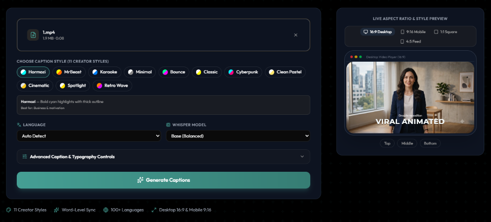

# AI Video Caption Generator

<p align="center">
  <strong>Free, open-source AI video caption generator with word-level animations, 11 creator styles, desktop & mobile ratios, and multi-format subtitle exports.</strong>
</p>

<p align="center">
  <a href="LICENSE"></a>
  <a href="https://github.com/kuka7466/video-caption-generator"></a>
  <a href="https://github.com/kuka7466/video-caption-generator/issues"></a>
</p>

<p align="center">
  
</p>

---

> [!NOTE]
> **Fork & Attribution Notice**:
> This repository is a standalone enhanced fork of the original open-source project [`nicolaigaina/ai-video-captions`](https://github.com/nicolaigaina/ai-video-captions) created by **Nicolai Gaina**.
> A sincere thank you to **Nicolai Gaina** for the excellent original foundation!

---

## Key Features & Enhancements

- **11 Creator Caption Styles & Animations**:
  - `Hormozi` (Bold cyan highlights with thick outline)
  - `MrBeast` (High-contrast yellow & orange pop)
  - `Karaoke` (Dynamic word wipe animation)
  - `Minimal` (Clean subtle scale pop)
  - `Bounce` (Playful spring bounce)
  - `Classic` (Traditional yellow highlight)
  - `Cyberpunk` *(NEW)* (Electric neon cyan & hot pink glow)
  - `Clean Pastel / Ali Abdaal` *(NEW)* (Soft yellow highlighter aesthetic)
  - `Cinematic` *(NEW)* (Letterbox format with warm gold accent)
  - `Spotlight` *(NEW)* (High-impact zoom scale burst)
  - `Retro Wave` *(NEW)* (80s synthwave neon vibes)

- **Desktop (16:9) & Multi-Aspect Ratio Support**:
  - Live interactive preview switcher: **16:9 Desktop / Landscape**, **9:16 Mobile / Vertical**, **1:1 Square**, and **4:5 Portrait**.
  - Automatic video aspect ratio detection upon file upload.
  - Resolution-aware ASS subtitle generator adapting typography character wrapping for wide desktop monitors ($36$ chars/line) and vertical screens ($18$ chars/line).

- **Granular Caption & Typography Customization**:
  - **Words Per Subtitle Block**: `Auto`, `1 Word` (Punchy hook), `2–3 Words` (Reels/TikTok), `4–6 Words` (YouTube), `7–10 Words` (Extended sentence).
  - **Max Number of Lines**: Single Line ($1$) or Two Lines ($2$).
  - **Creator Fonts**: *Outfit, Montserrat, Bebas Neue, Impact, Anton, Inter, Poppins, Cinzel, Bangers*.
  - **Font Size Scaling**: $75\%$ (Small), $100\%$ (Medium), $125\%$ (Large), $150\%$ (Extra Large).
  - **Text Transformation**: `UPPERCASE (ALL CAPS)`, `Title Case`, `lowercase`, `Original Transcription`.
  - **Custom Brand Colors**: Integrated color pickers for custom text & active highlight colors.

- **Multi-Format Subtitle Exports**:
  - Download fully burned **Captioned Video (`.mp4`)**.
  - Download standalone raw **Subtitles (`.srt`)** for video editors (CapCut, Premiere, DaVinci Resolve).
  - Download styled **Advanced Subtitles (`.ass`)**.

- **Standalone Windows Portability & CUDA Auto-Fallback**:
  - Bundled local FFmpeg binaries in `tools/ffmpeg/bin/` prioritized automatically for zero-dependency execution.
  - In-memory Whisper model caching to eliminate per-request weight loading overhead.
  - Automatic fallback from CUDA to CPU mode if `cublas64_12.dll` or CUDA drivers are not present, preventing crashes.

- **100% Private & Self-Hosted**:
  - Zero telemetry, zero accounts, zero third-party cloud uploads. All audio transcription and video burning run locally on your machine.

---

## Quick Start Guide

### Option 1: Standalone Windows 1-Click Launch (Zero Install)

1. Clone the repository:
   ```bash
   git clone https://github.com/kuka7466/video-caption-generator.git
   cd video-caption-generator
   ```
2. Double-click `start.bat` (or run in terminal):
   ```cmd
   start.bat
   ```
3. Your browser will automatically open to [http://localhost:3000](http://localhost:3000).

---

### Option 2: Docker Compose

```bash
git clone https://github.com/kuka7466/video-caption-generator.git
cd video-caption-generator
docker compose up
```

Open [http://localhost:3000](http://localhost:3000) to start generating captions.

---

### Option 3: Local Development

**Prerequisites:** Python 3.11+, Node.js 20+, FFmpeg

1. **Backend Setup**:
   ```bash
   cd backend
   python -m venv .venv
   .venv\Scripts\activate      # On Linux/macOS: source .venv/bin/activate
   pip install -r requirements.txt
   python app.py
   ```

2. **Frontend Setup**:
   ```bash
   cd frontend
   npm install
   npx prisma generate
   npx prisma db push
   npm run dev
   ```

---

## Tech Stack & Architecture

```
video-caption-generator/
├── frontend/             Next.js 16 (React 19, Tailwind CSS v4, shadcn/ui, Prisma SQLite)
│   ├── src/app/          Pages: landing, history, caption detail
│   ├── src/components/   UI: video dropzone, style picker, live preview canvas
│   └── src/actions/      Server actions (proxies to backend API)
│
├── backend/              Flask 3.1 + faster-whisper + pysubs2 + FFmpeg
│   ├── app.py            REST API endpoints (/api/process, /api/download, etc.)
│   ├── caption_job.py    Video probing, transcription, subtitle generation & burning
│   ├── subtitles.py      ASS subtitle generator with word animations & layout scaling
│   └── caption_styles.py Style definitions & color conversion utilities
│
├── tools/                Bundled portable tools & helpers (FFmpeg downloader)
├── start.bat             1-Click master Windows launcher
└── docker-compose.yml    Containerized deployment
```

---

## REST API Overview

| Method | Endpoint | Description |
| :--- | :--- | :--- |
| `GET` | `/api/health` | Service health check |
| `POST` | `/api/process` | Submit video for captioning with custom style, ratio & formatting |
| `GET` | `/api/status/<jobId>` | Real-time job progress and phase status |
| `GET` | `/api/download/<jobId>?format=mp4\|srt\|ass` | Download captioned video, SRT subtitles, or ASS subtitles |
| `DELETE` | `/api/jobs/<jobId>` | Clean up job files and metadata |

---

## Contributing

Contributions, issues, and feature requests are welcome!
Feel free to open an issue or submit a pull request on [GitHub Issues](https://github.com/kuka7466/video-caption-generator/issues).

---

## License & Acknowledgements

* Licensed under the [MIT License](LICENSE).
* Original base repository: [`nicolaigaina/ai-video-captions`](https://github.com/nicolaigaina/ai-video-captions) by **Nicolai Gaina**.
